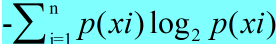

# 熵

在机器学习的过程中，我们经常会进行数据集的准备工作。那么怎么来评测我们划分的数据集，来证明我们的划分就是最好最合理的呢？这里我们就需要用到信息熵了。熵越大，随机变量的不确定性就越大。

    熵，定义为信息的期望值，是大名鼎鼎的香农提出来的概念。

    信息的定义：如果待分类的 Xi ，可能处于多个类别中，那么Xi 的信息定义为：

                    L（Xi) = -log2 p(xi)，其中p(Xi) 是处于该分类的概率

    为了计算熵，我们需要所有类别所可能包含的信息值，通过下面公式得到：

                    ，其中 n 是分类数量

熵越大，则混合的数据也越多。

直白点说，信息熵是用来度量数据集的无序程度的，其值越大，则越无序。

所以，一直有管理者提出“组织上熵减”就是追求组织上有序，规律，从而形成合力。